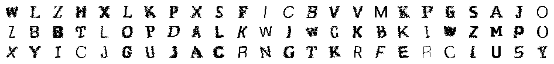
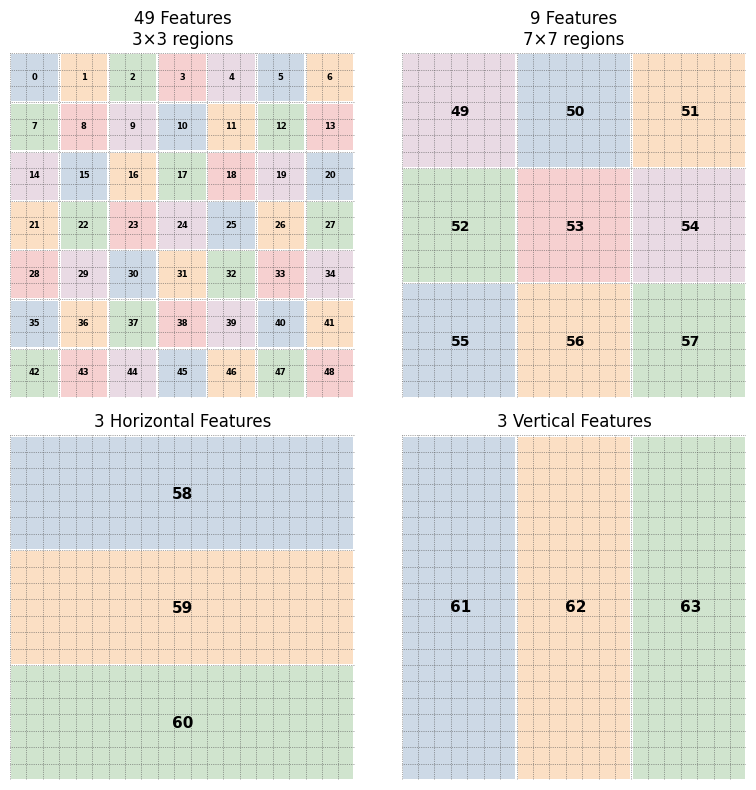

# Hiero Vision (OCR)

An OCR research project exploring how far carefully engineered features can push traditional machine learning.

Instead of feeding raw image pixels directly into a model, this project transforms handwritten characters into a compact spatial representation designed specifically for classical machine learning algorithms.

The goal was simple:

> Can feature engineering allow classical Gradient Boosting models to approach deep neural network performance on moderately noisy handwritten data?

---

## Training Data Characteristics

The models were trained on moderately noisy handwritten character data rather than perfectly clean inputs.

Artificial noise and augmentation were intentionally introduced during training to improve robustness and reduce overfitting. The objective was to expose models to imperfect conditions that more closely resemble real OCR scenarios.

### Examples of augmented training and testing samples:

  

---

## Results:

| Model | Accuracy |
|--------|-----------|
| LightGBM | 99.57% |
| XGBoost | 99.59% |
| CatBoost | 99.56% |
| Mini ResNet | 99.80% |
| WideResNet21 | 99.89% |

The most interesting result was not achieving high deep learning accuracy, but how closely a handcrafted representation allowed classical machine learning models to approach residual architectures.

The engineered representation compressed each sample from **441 raw pixels → 64 carefully designed features**, while still enabling classical models to achieve over **99.5% accuracy**.

---

## Feature Representation

Input images are resized to **21×21**, producing 441 raw pixel values.

Rather than using raw pixels directly, images are transformed into a compact **64-dimensional representation**:

- 49 local spatial features (3×3 regions)
- 9 coarse spatial features (7×7 regions)
- 3 horizontal stripe features
- 3 vertical stripe features

Each feature value stores the number of dark pixels contained inside its corresponding region in the representation above.

This representation preserves structure while significantly reducing dimensionality.

  

---

## Key Observation

Classical machine learning models achieved competitive accuracy while operating at substantially lower computational cost.

Training and inference remained significantly faster than deep residual architectures while requiring only a small reduction in final accuracy.

This project demonstrates that carefully engineered representations can provide an attractive tradeoff between:

- Accuracy
- Computational cost
- Model complexity
- Training speed

---

## Technologies

- Python
- PyTorch
- LightGBM
- XGBoost
- CatBoost
- NumPy
- Matplotlib
- Jupyter Notebook

---

## License

This project is licensed under the MIT License — see the [LICENSE.txt](LICENSE.txt) file for details.

---

## Connect

GitHub: https://github.com/mgoyalitm

LinkedIn: https://www.linkedin.com/in/mgoyal-itm

Toptal: https://www.toptal.com/developers/resume/mahendra-goyal